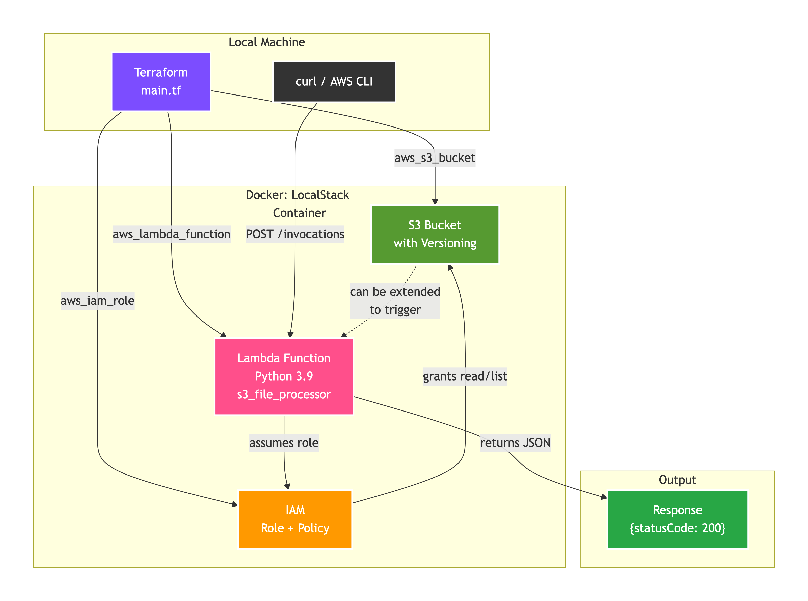

# ☁️ Cloud Data Platform · Infrastructure as Code

**Terraform · LocalStack · S3 · IAM · Lambda**

[](https://www.terraform.io/)
[](https://localstack.cloud/)
[](https://aws.amazon.com/)

> Production‑ready infrastructure for a serverless data platform, running **fully locally** with a true AWS API emulation.

---

## 📌 Overview

This project provisions a **serverless data processing pipeline** using Infrastructure as Code (IaC).  
All components run inside **LocalStack** — a 100% local AWS emulator — so you can develop, test, and demonstrate cloud skills without any real cloud costs or credentials.

The following AWS services are emulated and fully provisioned by Terraform:

- **S3** – object storage with versioning
- **IAM** – fine‑grained roles and policies
- **Lambda** – Python 3.9 function triggered by API calls

---

## 🧠 Architecture
<p align="left">
  
  <br>
</p>

**Flow:**
1. `terraform apply` creates all resources inside LocalStack.
2. The IAM role grants the Lambda function **read/list** permissions on the S3 bucket.
3. The Lambda function is invoked manually via `curl` or AWS CLI.
4. It returns a JSON response – proving the entire IAM → S3 → Lambda chain works.

---

## 🧩 Key Terraform Resources Explained

### Core Resources

| Resource | Code example | What it does |
|----------|--------------|----------------|
| `aws_s3_bucket` | `bucket = "my-data-platform-bucket"` | Creates an S3 bucket named `my-data-platform-bucket` with versioning enabled |
| `aws_s3_bucket_versioning` | `status = "Enabled"` | Enables versioning to keep history of all file changes |
| `aws_iam_role` | `assume_role_policy` with `Service = "lambda.amazonaws.com"` | Defines **who** can assume the role (in this case, Lambda service) |
| `aws_iam_policy` | `Action = ["s3:GetObject", "s3:ListBucket"]` | Defines **what actions** are allowed (read/list from S3) |
| `aws_iam_role_policy_attachment` | `role = aws_iam_role.lambda_role.name` | Attaches the policy to the role |
| `aws_lambda_function` | `filename = "lambda.zip"`, `runtime = "python3.9"` | Uploads the Python code and creates the Lambda function |

### Provider Configuration (Critical for LocalStack)

```
hcl
provider "aws" {
  region                      = "us-east-1"
  access_key                  = "test"           # fake credentials
  secret_key                  = "test"
  skip_credentials_validation = true
  s3_use_path_style           = true             # required for LocalStack
  
  endpoints {
    s3     = "http://localhost:4566"              # redirect to LocalStack
    iam    = "http://localhost:4566"
    lambda = "http://localhost:4566"
  }
}
```

## 🛠 Tech Stack

| Tool | Purpose |
|------|---------|
| **Terraform** (HCL) | Infrastructure as Code – defines and provisions all resources |
| **LocalStack** | Local AWS cloud emulator (S3, IAM, Lambda APIs) |
| **Python 3.9** | Runtime for the Lambda function |
| **Docker** | Runs LocalStack container |
| **AWS CLI** (optional) | Interact with the local endpoints |

---

## 🚀 Getting Started (Step‑by‑Step)

Follow these instructions exactly — they work on **macOS / Linux / Windows (WSL2)**.

### 1️⃣ Install prerequisites

- [Docker Desktop](https://www.docker.com/products/docker-desktop/) (running)
- [Terraform](https://developer.hashicorp.com/terraform/downloads) (>= 1.5)
- [Python 3.9+](https://www.python.org/downloads/)
- `curl` (usually pre‑installed)

### 2️⃣ Get a free LocalStack auth token

LocalStack now requires a free account for Lambda support.

1. Go to LocalStack Getting Started
2. Sign up / Sign in (GitHub account works)
3. Find your Auth Token in the dashboard (under “Account” → “Auth Token”)
4. Copy the token – it looks like ls-xxxxxx-xxxx-xxxx-xxxx-xxxxxxxxxxxx

### 3️⃣ Start LocalStack with Lambda support

Run the container with the token and Docker socket access (required for Lambda):
```
docker run -d --name localstack \
  -p 4566:4566 \
  -v /var/run/docker.sock:/var/run/docker.sock \
  -e SERVICES=s3,lambda,iam \
  -e LAMBDA_EXECUTOR=docker \
  -e LOCALSTACK_AUTH_TOKEN=ls-your-token-here \
  localstack/localstack
```

Check that the container is healthy:

```
curl http://localhost:4566/_localstack/health
```

All services (s3, lambda, iam) should show "available".

### 4️⃣ Build the Lambda package 

From the project root:

```
cd lambda_function
zip ../lambda.zip index.py
cd ..
```

### 5️⃣ Deploy the infrastructure

```
terraform init
terraform apply -auto-approve
```
You should see:
Apply complete! Resources: 5 added, 0 changed, 0 destroyed.

### 6️⃣ Invoke the Lambda function

```
curl -X POST http://localhost:4566/2015-03-31/functions/s3_file_processor/invocations \
  -H "Content-Type: application/json" \
  -d '{"test": "hello"}'
```

✅ Expected response:

```
{"statusCode":200,"body":"{\"message\": \"Lambda applied successfully!\"}"}
```

🧹 Clean Up
To stop LocalStack and remove all resources:

```
terraform destroy -auto-approve
docker stop localstack && docker rm localstack
```

